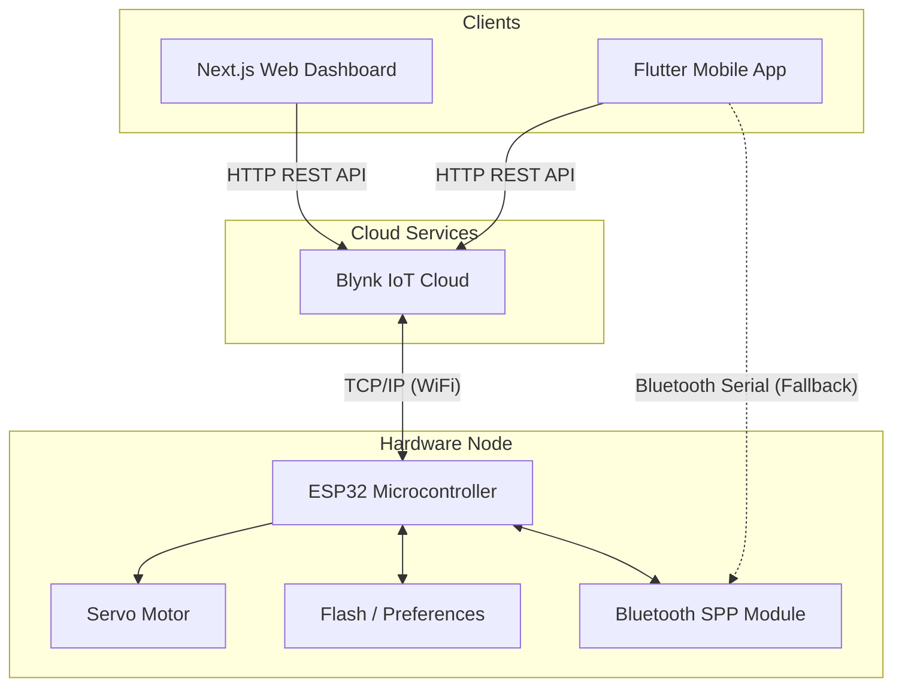
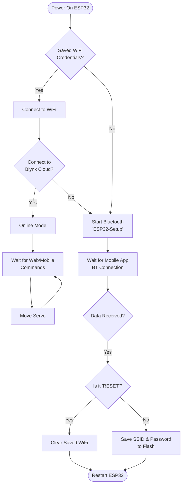

# Smart Cloches IoT Controller 🪴🤖

A complete, production-ready IoT ecosystem for controlling and monitoring servo-based mechanisms (e.g., smart greenhouse cloches, automated vents, or feeders). This repository follows a monorepo structure containing the hardware firmware, a web-based dashboard, and a native mobile application.

## 🏗️ System Architecture

The system utilizes an ESP32 microcontroller connected to the Blynk IoT Cloud. It provides cross-platform remote control via HTTP APIs, with a local Bluetooth fallback mechanism for initial WiFi provisioning.



## 📦 Repository Structure

- `sketch_apr25b/` - ESP32 Firmware (C++ / Arduino IDE)
- `/` *(Root)* - Next.js Web Dashboard
- `smartcloches-mobile/` - Flutter Android Application

---

## 🚀 Core Features

1. **Hardware (ESP32)**
   - **Step-based Servo Smoothing:** Servo movements are mathematically smoothed (steps 1-10) to prevent mechanical stress.
   - **Bluetooth Provisioning:** If the ESP32 fails to find a saved WiFi network, it broadcasts an SPP Bluetooth signal (`ESP32-Setup`).
   - **Persistent Storage:** WiFi credentials (SSID & Password) are saved securely to the ESP32's internal flash using the `Preferences` library.

2. **Web Dashboard (Next.js 15)**
   - **Server Actions:** Securely proxies Blynk API calls backend-to-backend to prevent exposing the Blynk Auth Token to the browser.
   - **Glassmorphism UI:** Premium, responsive dark-mode UI crafted with pure CSS.
   - **Real-time Polling:** Seamless online/offline status detection.

3. **Mobile App (Flutter)**
   - **Native Performance:** Fluid animations and haptic feedback.
   - **Bluetooth Setup Utility:** Integrated Bluetooth scanner to directly provision the ESP32's WiFi credentials without needing third-party serial apps.
   - **Seamless Sync:** State synchronization with the web dashboard via Blynk Cloud.

---

## 🔌 Hardware Pinout

| ESP32 Pin | Component | Description |
| :--- | :--- | :--- |
| `GPIO 18` | Servo Motor (PWM) | Controls the mechanism angle |
| `5V / VIN` | Servo VCC | Use external 5V power supply for high-torque servos |
| `GND` | Common Ground | Tie ESP32 and external power supply grounds |

*Note: The ESP32 requires the `ESP32Servo` and `Blynk` libraries installed in your Arduino IDE.*

---

## 🛠️ Setup & Installation

### 1. Blynk Cloud Configuration
1. Create a template in [Blynk.Cloud](https://blynk.cloud).
2. Create two Virtual Pins:
   - **V4 (Integer):** Range `0` to `1` (Position Toggle).
   - **V5 (Integer):** Range `0` to `100` (Speed Control).
3. Get your `BLYNK_AUTH_TOKEN`.

### 2. ESP32 Firmware Setup
1. Open the `.ino` file in the Arduino IDE.
2. Replace `BLYNK_AUTH_TOKEN` with your actual token.
3. Flash the code to your ESP32.
4. *Initial Boot:* The ESP32 will start its Bluetooth module (`ESP32-Setup`) since no WiFi is saved.

### 3. Web Dashboard Setup
1. Clone this repository and run `npm install`.
2. Create a `.env.local` file in the root directory:
   ```env
   BLYNK_TOKEN=your_blynk_auth_token_here
   ```
3. Start the server:
   ```bash
   npm run dev
   ```
4. Access `http://localhost:3000`.

### 4. Mobile App Setup (Flutter)
1. Ensure the Android SDK and Flutter are installed.
2. Navigate to the mobile directory:
   ```bash
   cd smartcloches-mobile
   flutter pub get
   ```
3. Update the `blynk_service.dart` with your token (or fetch dynamically via your backend).
4. Build the APK:
   ```bash
   flutter build apk --release
   ```

---

## 📡 Usage Flow & Provisioning



1. **First Boot:** Power up the ESP32. The LED/Serial Monitor will indicate it is waiting for Bluetooth.
2. **Pairing:** Open your Android Phone's Settings -> Bluetooth, and pair with `ESP32-Setup`.
3. **Provisioning:** Open the *Smart Cloches* mobile app, tap the **Bluetooth (⚙️)** icon, enter your WiFi credentials, and tap send.
4. **Operation:** The ESP32 will save the credentials, connect to WiFi, and sync with Blynk. You can now control the servo globally via the Web Dashboard or the Mobile App.
5. **Reset:** To change WiFi networks, send the `RESET` command via the mobile app's Bluetooth Setup screen.

---

## 🛡️ Security Note
- Never commit your `.env.local` file. It is ignored in `.gitignore`.
- The Next.js dashboard uses Server Actions, meaning network requests to Blynk are made server-side, hiding your token from the client payload.

---
*Built for the future of Smart Agriculture.*
