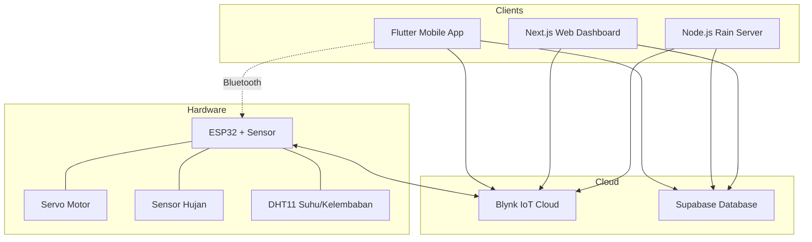
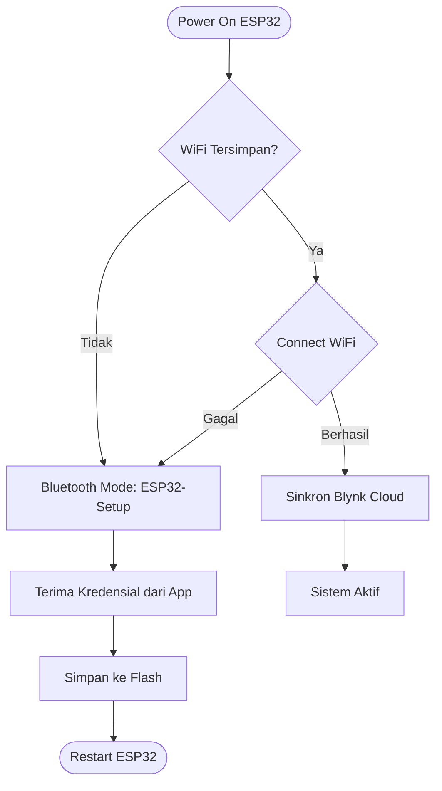

# Smart Clothesline — IoT Jemuran Otomatis

Sistem IoT lengkap untuk jemuran otomatis berbasis ESP32. Jemuran buka-tutup secara otomatis berdasarkan sensor hujan, suhu, kelembaban, dan **peringatan hujan dari tetangga dalam radius 1 km** (Distributed Rain Warning).

## Arsitektur Sistem



## Struktur Folder

```
smartcloches-controller-iot/
├── sketch_apr25b/          # Firmware ESP32 (Arduino C++)
├── smartcloches-mobile/    # Mobile App (Flutter/Dart)
├── server/                 # Background Rain Warning Service (Node.js)
├── src/app/                # Web Dashboard (Next.js)
│   ├── page.tsx            # Dashboard utama
│   └── demo/page.tsx       # Demo distributed rain warning
├── .env.local              # Environment variables (web)
└── README.md
```

## Fitur

| Komponen | Fitur |
|:---|:---|
| **ESP32** | Sensor hujan, DHT11, servo smoothing, Bluetooth provisioning, WiFi auto-reconnect |
| **Mobile App** | Login, set lokasi GPS, kontrol servo, monitoring sensor, notifikasi, distributed rain warning |
| **Web Dashboard** | Kontrol servo, monitoring real-time, dark mode glassmorphism UI |
| **Web Demo** | Tabel semua user, generate user dummy, toggle rain status untuk testing |
| **Rain Server** | Background service, cek hujan tetangga tiap 10 detik, auto buka/tutup servo |

## Pinout Hardware

| ESP32 Pin | Komponen | Keterangan |
|:---|:---|:---|
| `GPIO 18` | Servo Motor (PWM) | Buka (90°) / Tutup (0°) |
| `GPIO 34` | Rain Sensor (Analog) | Threshold: 3000 |
| `GPIO 19` | DHT11 (Digital) | Suhu & Kelembaban |
| `5V / VIN` | Power | Gunakan power supply eksternal untuk servo |
| `GND` | Common Ground | Sambungkan ground ESP32 dan power supply |

## Blynk Virtual Pin

| Pin | Tipe | Fungsi |
|:---|:---|:---|
| `V4` | Integer (0-1) | Posisi servo: 0 = tutup, 1 = buka |
| `V5` | Integer (0-100) | Kecepatan servo |
| `V6` | Integer | Suhu (°C) |
| `V7` | Integer | Kelembaban (%) |
| `V8` | Integer (0-1) | Status hujan: 0 = kering, 1 = basah |

---

## Logika Keputusan Buka/Tutup Jemuran

Sistem menggunakan **3 layer keputusan** yang bekerja berlapis:

### Layer 1: ESP32 (Hardware — Realtime)

Decision engine di ESP32 menggunakan sistem **prioritas**:

```
PRIORITAS 1: Sensor Hujan
  └─ Basah? → TUTUP JEMURAN (tidak bisa di-override)

PRIORITAS 1.5: Hujan Baru Berhenti
  └─ Tadi basah, sekarang kering? → BUKA JEMURAN otomatis

PRIORITAS 2: Manual Override
  └─ User tekan toggle di app? → Ikuti perintah user

PRIORITAS 3: Auto Climate (DHT)
  └─ Kelembaban > 80% DAN suhu turun? → TUTUP (tanda mau hujan)
  └─ Suhu >= 40°C? → BUKA (panas, cocok jemur)
```

### Layer 2: Mobile App (Distributed Rain — Tiap 5 Detik)

Aplikasi mengecek database Supabase:

```
Setiap 5 detik:
  └─ Ada user dalam radius 1km yang hujan?
      ├─ YA → TUTUP JEMURAN
      └─ TIDAK + sensor lokal kering? → BUKA JEMURAN
```

### Layer 3: Server Node.js (Background — Tiap 10 Detik)

Server berjalan 24/7 tanpa perlu app terbuka:

```
Setiap 10 detik:
  └─ Untuk setiap user yang punya lokasi:
      ├─ Baca sensor hujan dari Blynk
      ├─ Update status ke database
      ├─ Cek tetangga 1km yang hujan
      ├─ Ada yang hujan? → TUTUP servo
      └─ Semua cerah? → BUKA servo
```

---

### Studi Kasus: Pak Budi vs Hujan

Berikut skenario nyata bagaimana ketiga layer bekerja:

#### Skenario 1 — Hujan Langsung Kena Sensor

> **Jam 14:00** — Pak Budi sedang di rumah, jemuran terbuka.
> Tiba-tiba hujan turun dan membasahi sensor.

```
1. Sensor hujan ESP32 membaca nilai < 3000 (basah)     → 0.01 detik
2. updateDecision() langsung dipanggil                   → 0.01 detik
3. Servo menutup ke posisi 0°                            → instan
4. Blynk V8 diupdate = 1 (hujan)
5. Mobile app menampilkan "Sedang Hujan"
6. Status Pak Budi di Supabase: is_raining = true
```

**Total waktu: < 1 detik.** Jemuran langsung tertutup.

#### Skenario 2 — Hujan Berhenti

> **Jam 14:30** — Hujan berhenti. Sensor mengering.

```
1. Sensor membaca nilai > 3000 (kering)
2. Sistem mendeteksi wasWet = true, isWet = false
3. PRIORITAS 1.5 aktif → "Hujan baru berhenti"
4. Servo membuka ke posisi 90° otomatis
5. Status Supabase: is_raining = false
```

**Pak Budi tidak perlu buka app.** Jemuran otomatis terbuka kembali.

#### Skenario 3 — Hujan di Tetangga (Distributed Warning)

> **Jam 15:00** — Cuaca cerah di rumah Pak Budi.
> Tapi Bu Sari (300m jauhnya) sudah kehujanan.

```
1. Sensor Bu Sari mendeteksi hujan
2. Server/app Bu Sari update Supabase: is_raining = true
3. Server Node.js mengecek:
   - Query: "Siapa dalam 1km dari Pak Budi yang hujan?"
   - Hasil: Bu Sari (300m, hujan)
4. Server mengirim V4=0 ke Blynk → servo Pak Budi TUTUP
5. Mobile app Pak Budi menampilkan notifikasi:
   "1 user sekitar sedang hujan"
```

**Jemuran Pak Budi tertutup SEBELUM hujan sampai ke rumahnya.**

#### Skenario 4 — Manual Override

> **Jam 15:15** — Pak Budi lihat langit sudah cerah.
> Dia yakin tidak akan hujan dan ingin buka jemuran.

```
1. Pak Budi tekan toggle "Buka" di mobile app
2. App mengirim V4=1 ke Blynk
3. ESP32 menerima → manualOverride = true
4. Servo membuka ke 90°
5. Cooldown 6 detik: polling tidak menimpa state manual
```

**Manual override selalu bisa digunakan.** Tapi kalau hujan benar-benar turun dan kena sensor, PRIORITAS 1 tetap menutup (keselamatan jemuran di atas segalanya).

#### Skenario 5 — Tanda Cuaca Buruk (DHT)

> **Jam 16:00** — Belum hujan, tapi kelembaban naik ke 85% dan suhu turun.

```
1. DHT membaca: kelembaban 85%, suhu turun dari 32° ke 30°
2. PRIORITAS 3 aktif: hum > 80% DAN temp < lastTemp
3. Servo menutup ke 0° (antisipasi hujan)
4. App menampilkan notifikasi: "Mendung Terdeteksi"
```

**Sistem menutup jemuran sebelum hujan turun** berdasarkan pola cuaca.

---

### Ringkasan Prioritas

| Prioritas | Kondisi | Aksi | Bisa di-Override? |
|:---|:---|:---|:---|
| **1 (Tertinggi)** | Sensor hujan basah | TUTUP | Tidak |
| **1.5** | Hujan baru berhenti | BUKA | Tidak |
| **Distributed** | Tetangga 1km hujan | TUTUP | Ya (manual) |
| **2** | User tekan toggle | Ikuti user | Ya (hujan fisik) |
| **3 (Terendah)** | Kelembaban tinggi + suhu turun | TUTUP | Ya (manual) |
| **3** | Suhu >= 40°C | BUKA | Ya (manual) |

---

## Setup & Instalasi

### 1. Blynk Cloud

1. Buat template di [Blynk.Cloud](https://blynk.cloud)
2. Buat Virtual Pin V4, V5, V6, V7, V8 sesuai tabel di atas
3. Catat `BLYNK_AUTH_TOKEN`

### 2. Supabase Database

1. Buat project di [Supabase](https://supabase.com)
2. Buka SQL Editor, jalankan isi file `smartcloches-mobile/supabase_setup.sql`
3. Catat `SUPABASE_URL` dan `SUPABASE_ANON_KEY`

### 3. ESP32 Firmware

```bash
# Buka sketch_apr25b/sketch_apr25b.ino di Arduino IDE
# Install library: ESP32Servo, Blynk, DHT sensor library
# Ganti BLYNK_AUTH_TOKEN, flash ke ESP32
```

### 4. Web Dashboard

```bash
npm install

# Buat .env.local
echo "BLYNK_TOKEN=your_token" > .env.local
echo "NEXT_PUBLIC_SUPABASE_URL=your_url" >> .env.local
echo "NEXT_PUBLIC_SUPABASE_ANON_KEY=your_key" >> .env.local

npm run dev
# Buka http://localhost:3000 (dashboard)
# Buka http://localhost:3000/demo (rain warning demo)
```

### 5. Mobile App (Flutter)

```bash
cd smartcloches-mobile
flutter pub get

# Update token di lib/services/blynk_service.dart
# Update Supabase URL/key di lib/main.dart

flutter run          # development
flutter build apk    # production
```

### 6. Rain Warning Server

```bash
cd server
npm install

# Buat .env
echo "SUPABASE_URL=your_url" > .env
echo "SUPABASE_KEY=your_key" >> .env
echo "BLYNK_TOKEN=your_token" >> .env

npm start
```

---

## Alur Provisioning WiFi



1. **Boot Pertama:** ESP32 menyalakan Bluetooth (`ESP32-Setup`)
2. **Pairing:** Buka Settings Bluetooth di HP, pair dengan `ESP32-Setup`
3. **Provisioning:** Buka mobile app → ikon Bluetooth → masukkan SSID & password → kirim
4. **Operasi:** ESP32 menyimpan kredensial, connect WiFi, sinkron Blynk
5. **Reset:** Kirim perintah `RESET` via Bluetooth untuk hapus kredensial WiFi

---

## Keamanan

- `.env.local` dan `server/.env` sudah ada di `.gitignore`
- Web dashboard menggunakan Server Actions (token tidak terekspos ke browser)
- Supabase RLS aktif dengan policy permissive (untuk demo)

---

*Built for Smart Clothesline IoT System*
