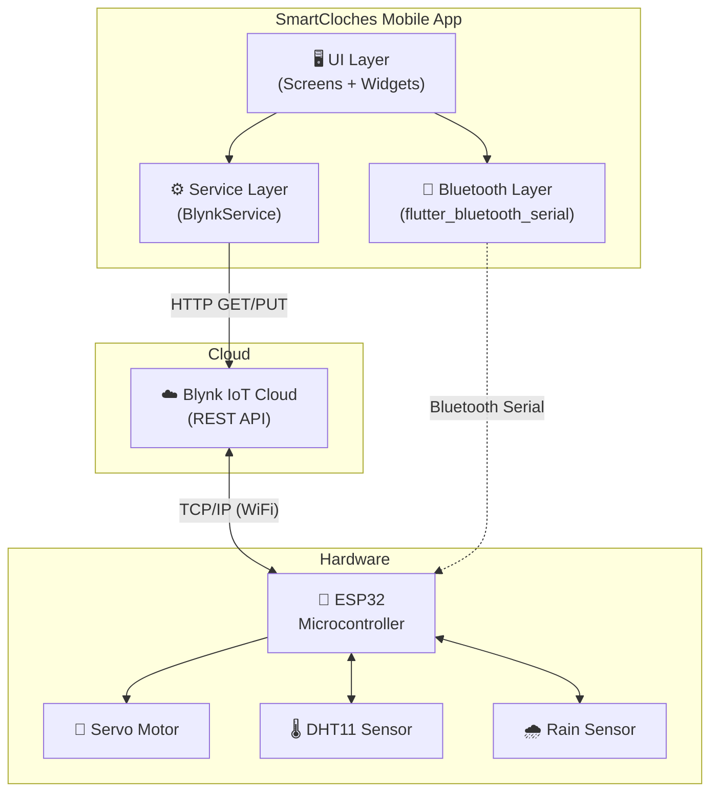
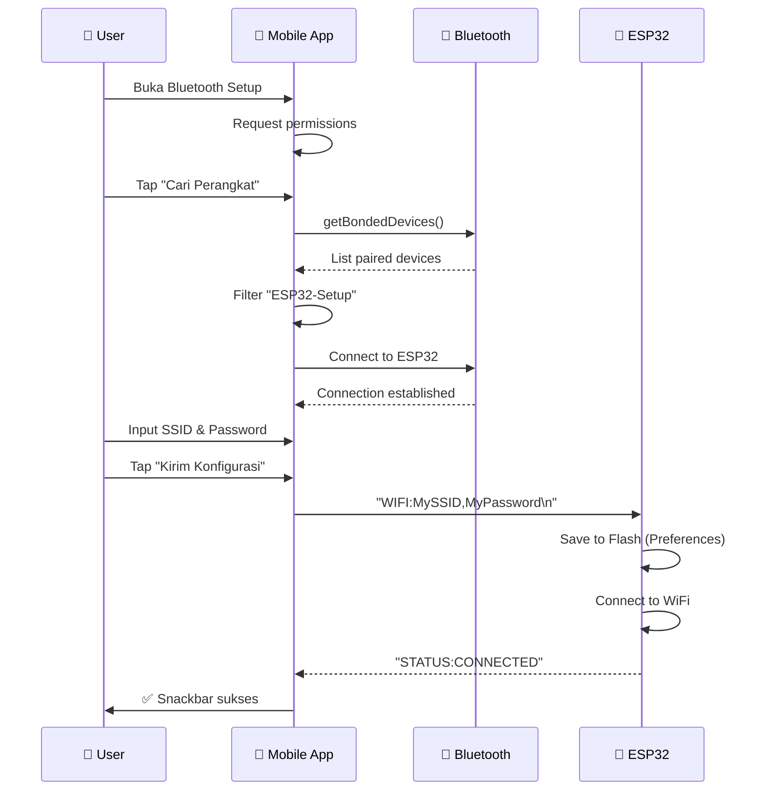
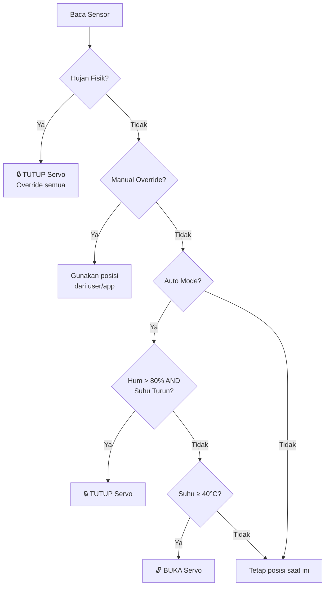

# 📱 SmartCloches — Mobile Application

> **Aplikasi mobile native berbasis Flutter** untuk mengontrol dan memonitor sistem Smart Cloches IoT secara real-time melalui Blynk Cloud, dilengkapi fitur Bluetooth provisioning untuk konfigurasi WiFi awal pada ESP32.

---

## 📌 Ringkasan Proyek

| Item | Detail |
|:---|:---|
| **Nama Aplikasi** | SmartCloches Mobile |
| **Framework** | Flutter (Dart SDK ≥ 3.6.0) |
| **Target Platform** | Android |
| **Backend / Cloud** | Blynk IoT Cloud (REST API) |
| **Komunikasi Hardware** | Bluetooth Serial (SPP) + WiFi via Blynk |
| **Versi** | 1.0.0+1 |

---

## 🏗️ Arsitektur Aplikasi



### Alur Data

1. **Monitoring:** ESP32 membaca sensor → kirim data ke Blynk Cloud → aplikasi mobile polling setiap **5 detik** via REST API → update UI secara real-time.
2. **Kontrol:** User tap tombol di aplikasi → HTTP request ke Blynk API → Blynk push ke ESP32 via TCP/IP → servo bergerak.
3. **Provisioning:** User input WiFi credentials di aplikasi → kirim via Bluetooth Serial ke ESP32 → ESP32 simpan ke flash memory → connect ke WiFi.

---

## 📂 Struktur Direktori

```
smartcloches-mobile/
├── lib/
│   ├── main.dart                          # Entry point aplikasi
│   ├── screens/
│   │   ├── home_page.dart                 # Halaman utama (dashboard)
│   │   └── bluetooth_setup_screen.dart    # Halaman setup WiFi via Bluetooth
│   ├── services/
│   │   └── blynk_service.dart             # API service untuk komunikasi Blynk
│   ├── theme/
│   │   └── app_theme.dart                 # Design system & color palette
│   └── widgets/
│       ├── glass_card.dart                # Reusable card dengan soft shadow
│       ├── sensor_card.dart               # Card untuk menampilkan data sensor
│       ├── sensor_history_chart.dart       # Grafik live (custom painter)
│       ├── servo_toggle.dart              # Toggle kontrol servo (visual + switch)
│       ├── speed_control.dart             # Slider kontrol kecepatan servo
│       └── rain_status_card.dart          # Card status cuaca/hujan
├── android/                               # Konfigurasi native Android
├── pubspec.yaml                           # Dependencies & metadata
└── analysis_options.yaml                  # Lint rules
```

---

## ✨ Fitur Utama

### 1. 🏠 Dashboard Real-Time

Halaman utama menampilkan seluruh informasi dan kontrol dalam satu layar scrollable:

| Komponen | Deskripsi |
|:---|:---|
| **Status Online/Offline** | Indikator hijau/merah di header menunjukkan konektivitas ESP32 |
| **Sensor Cards** | Menampilkan suhu (°C) dan kelembaban (%) dalam card grid 2 kolom |
| **Rain Status** | Kartu peringatan cuaca — berubah warna saat hujan terdeteksi |
| **Servo Toggle** | Kontrol buka/tutup servo dengan animasi visual 0°↔90° |
| **Speed Slider** | Pengaturan kecepatan servo (Step 1–10) dengan label deskriptif |
| **Live Chart** | Grafik real-time suhu & kelembaban menggunakan Custom Painter |
| **Notifikasi** | Push notification lokal saat hujan terdeteksi atau suhu turun drastis |

### 2. 🔵 Bluetooth WiFi Provisioning

Halaman khusus untuk mengkonfigurasi WiFi pada ESP32 tanpa aplikasi serial pihak ketiga:



**Fitur Bluetooth Setup:**
- Auto-scan perangkat yang sudah di-pair
- Filter otomatis perangkat bernama `ESP32-Setup`
- Kirim kredensial WiFi dalam format `WIFI:SSID,PASSWORD\n`
- Terima balasan status dari ESP32 secara real-time
- Tombol **RESET** untuk menghapus konfigurasi WiFi dari flash ESP32

### 3. 🔔 Sistem Notifikasi Cerdas

Aplikasi menganalisis perubahan data sensor dan mengirim notifikasi lokal:

| Trigger | Notifikasi | Ikon |
|:---|:---|:---|
| Suhu turun ≥ 1.5°C dari pembacaan sebelumnya | "Mendung Terdeteksi" | ☁️ |
| Rain sensor mendeteksi air (V8 = 1) | "Hujan Terdeteksi!" | ☂️ |

Notifikasi ditampilkan sebagai:
- **SnackBar** floating dengan warna kontekstual
- **Bottom Sheet** untuk riwayat lengkap (scroll)
- **Badge counter** di ikon notifikasi pada AppBar

### 4. 📊 Live Monitoring Chart

Grafik real-time yang di-render menggunakan `CustomPainter` (tanpa library chart eksternal):

- **Smooth Bézier curves** (cubic interpolation)
- **Gradient fill** di bawah garis
- **Animasi entry** saat data baru masuk
- **Toggle** per dataset (Suhu / Kelembaban)
- **Stat chips** menampilkan nilai terkini
- Buffer hingga **60 data point** (≈ 5 menit pada polling 5 detik)

---

## 🔗 Blynk API Integration

### Virtual Pin Mapping

| Virtual Pin | Datastream ID | Tipe | Fungsi | Range |
|:---|:---|:---|:---|:---|
| **V4** | — | Integer | Posisi Servo (Toggle) | `0` (Tutup) / `1` (Buka) |
| **V5** | — | Integer | Kecepatan Servo | `0` – `100` |
| **V6** | — | Integer | Suhu (dari DHT11) | — |
| **V7** | — | Integer | Kelembaban (dari DHT11) | — |
| **V8** | — | Integer | Status Hujan (dari Rain Sensor) | `0` (Kering) / `1` (Basah) |

### Endpoint API yang Digunakan

```
Base URL: https://blynk.cloud/external/api

GET  /update?token={TOKEN}&V4={value}     → Set posisi servo
GET  /update?token={TOKEN}&V5={value}     → Set kecepatan servo
GET  /get?token={TOKEN}&V4               → Baca posisi servo
GET  /get?token={TOKEN}&V5               → Baca kecepatan
GET  /get?token={TOKEN}&V6               → Baca suhu
GET  /get?token={TOKEN}&V7               → Baca kelembaban
GET  /get?token={TOKEN}&V8               → Baca status hujan
GET  /data/get?token={TOKEN}&period={P}&dataStreamId={ID}&format=json → History data
```

### Polling Mechanism

```dart
// Polling setiap 5 detik di home_page.dart
_pollTimer = Timer.periodic(
  const Duration(seconds: 5),
  (_) => _fetchStatus(),
);
```

Setiap cycle polling, aplikasi memanggil **5 API request** secara sequential:
`getServoStatus()` → `getServoSpeed()` → `getTemperature()` → `getHumidity()` → `getRainStatus()`

---

## 🎨 Design System

### Color Palette

| Nama | Hex | Penggunaan |
|:---|:---|:---|
| `bgColor` | `#F5F7FA` | Background utama |
| `cardBg` | `#FFFFFF` | Background kartu |
| `accentPrimary` | `#2563EB` | Warna aksen utama (biru) |
| `accentSecondary` | `#7C3AED` | Warna aksen sekunder (ungu) |
| `success` | `#10B981` | Status online / cerah |
| `danger` | `#EF4444` | Status offline / hujan |
| `warning` | `#F59E0B` | Peringatan |
| `tempColor` | `#F97316` | Data suhu (oranye) |
| `humColor` | `#06B6D4` | Data kelembaban (cyan) |
| `rainColor` | `#6366F1` | Status hujan (indigo) |

### Komponen UI Reusable

#### `GlassCard`
Card container dengan soft shadow dan border halus. Digunakan sebagai wrapper di seluruh aplikasi.

```dart
GlassCard(
  padding: const EdgeInsets.all(24),
  child: YourContent(),
)
```

#### `SensorCard`
Menampilkan data sensor dengan ikon, nilai besar, unit, dan mini progress bar.

```dart
SensorCard(
  title: 'SUHU',
  value: '28.5',
  unit: '°C',
  icon: Icons.thermostat_rounded,
  color: AppTheme.tempColor,
)
```

#### `ServoToggle`
Visual kontrol servo dengan:
- Lingkaran besar menampilkan sudut (0° / 90°)
- Animasi lengan servo (`AnimatedRotation` dengan `Curves.elasticOut`)
- Custom toggle switch dengan gradient
- Haptic feedback (`HapticFeedback.heavyImpact`)

#### `SpeedControl`
Slider kecepatan dengan:
- Label deskriptif (🐢 Sangat Lambat → 🔥 Sangat Cepat)
- Step indicator (10 bar visual)
- Badge menampilkan step saat ini

#### `SensorHistoryChart`
Grafik custom tanpa library eksternal:
- `CustomPainter` untuk rendering line chart
- Toggle per dataset
- Animasi smooth pada entry data baru

---

## 📦 Dependencies

```yaml
dependencies:
  flutter: sdk
  http: ^1.4.0                        # HTTP client untuk Blynk API
  google_fonts: ^6.2.1                # Typography (Inter font)
  cupertino_icons: ^1.0.8             # iOS-style icons
  flutter_bluetooth_serial: ^0.4.0    # Bluetooth SPP untuk provisioning
  permission_handler: ^12.0.1         # Runtime permission management

dev_dependencies:
  flutter_test: sdk
  flutter_lints: ^5.0.0               # Lint rules
```

---

## 🚀 Cara Menjalankan

### Prerequisites
- Flutter SDK ≥ 3.6.0
- Android SDK
- Perangkat Android fisik (Bluetooth tidak tersedia di emulator)

### Langkah-langkah

```bash
# 1. Masuk ke direktori mobile
cd smartcloches-mobile

# 2. Install dependencies
flutter pub get

# 3. Jalankan di device
flutter run

# 4. Build APK release
flutter build apk --release
```

### Konfigurasi Token Blynk

Edit file `lib/services/blynk_service.dart`, ganti token pada baris:

```dart
static const String _token = 'YOUR_BLYNK_AUTH_TOKEN';
```

---

## 📡 Alur Penggunaan

### Skenario 1: First-Time Setup (ESP32 Baru)

```
1. Flash firmware ke ESP32
2. ESP32 nyala → tidak ada WiFi tersimpan → mode Bluetooth aktif ("ESP32-Setup")
3. Buka Pengaturan Bluetooth HP → Pair "ESP32-Setup"
4. Buka aplikasi SmartCloches → tap ikon Bluetooth (⚙️) di AppBar
5. Tap "Cari Perangkat ESP32" → koneksi berhasil
6. Masukkan SSID & Password WiFi
7. Tap "Kirim Konfigurasi"
8. ESP32 menyimpan credential → connect WiFi → sync Blynk
9. Kembali ke Dashboard → status "Online" ✅
```

### Skenario 2: Daily Operation

```
1. Buka aplikasi → Dashboard otomatis polling data setiap 5 detik
2. Lihat suhu, kelembaban, dan status hujan real-time
3. Tap toggle servo untuk buka/tutup cloche secara manual
4. Atur kecepatan servo via slider
5. Terima notifikasi otomatis jika hujan terdeteksi
6. Pantau trend suhu & kelembaban di grafik live
```

### Skenario 3: Ganti Jaringan WiFi

```
1. Buka Bluetooth Setup screen
2. Connect ke ESP32
3. Tap tombol RESET (🔄) → WiFi config terhapus dari flash
4. ESP32 restart → masuk mode Bluetooth lagi
5. Kirim konfigurasi WiFi baru
```

---

## 🧠 Decision Engine (Sisi Hardware)

Aplikasi mobile bekerja bersama decision engine di ESP32 yang berjalan otomatis:



**Prioritas Keputusan:**
1. 🥇 **Hujan fisik** (rain sensor) → selalu tutup, override semua
2. 🥈 **Manual override** (dari app/web) → user punya kontrol penuh
3. 🥉 **Auto mode** (DHT11) → keputusan berdasarkan suhu & kelembaban

---

## 🛡️ Catatan Keamanan

> [!WARNING]
> File `blynk_service.dart` saat ini menyimpan **Blynk Auth Token secara hardcoded** di source code. Untuk production, disarankan:
> - Simpan token di secure storage (flutter_secure_storage)
> - Atau fetch token dari backend pribadi
> - Jangan commit token ke repository publik

---

## 🔮 Rencana Pengembangan

- [ ] Migrasi ke secure token storage
- [ ] Dark mode theme
- [ ] Push notification via Firebase Cloud Messaging
- [ ] Widget home screen Android
- [ ] Riwayat data sensor jangka panjang (offline DB)
- [ ] Multi-device support (lebih dari 1 ESP32)
- [ ] iOS support

---

*Dokumentasi ini terakhir diperbarui: Mei 2026*
